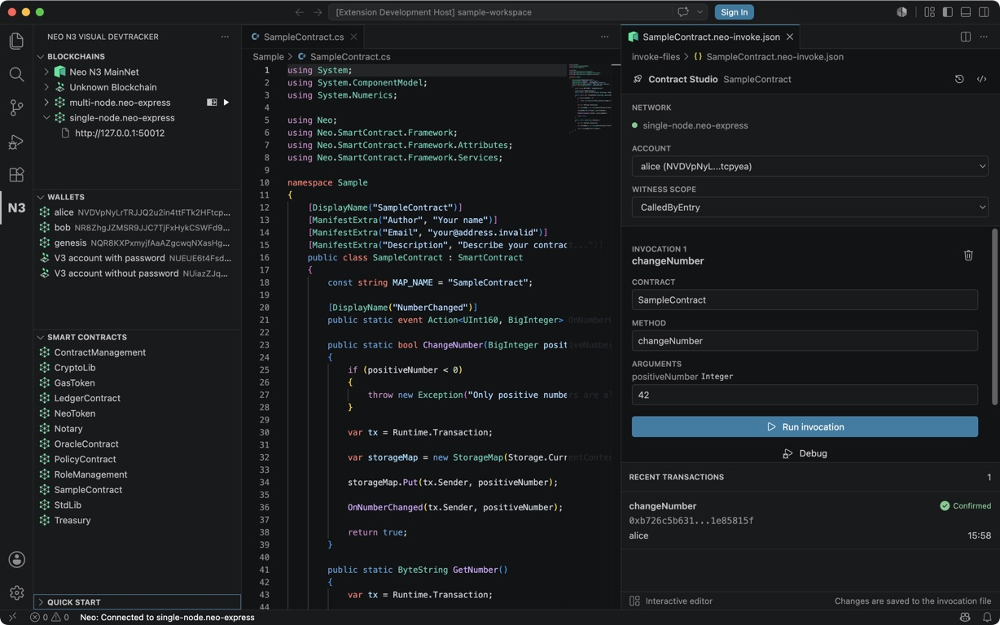

# Neo N3 Visual DevTracker

Neo N3 Visual DevTracker brings the local Neo Express development workflow into Visual Studio Code. Create and run private chains, build and deploy contracts, invoke contract methods, inspect transactions, and explore blockchain state without leaving the editor.

> This extension targets Neo N3 only. The Neo Legacy network has been shut down and is no longer supported.

## Features

- Create, start, stop, reset, and restore Neo Express blockchains.
- Create wallets, transfer assets, deploy contracts, and explore contract storage.
- Inspect blocks, transactions, contracts, and wallets from the Neo N3 activity view.
- Build reusable `.neo-invoke.json` workflows in Contract Studio.
- Select the Neo Express network, signing account, and witness scope before invoking a contract.
- Track submitted transactions from pending state through confirmation.
- Launch source debugging for contracts built in the current workspace.

## Contract Studio

Contract Studio keeps contract source in the normal VS Code editor while opening the invocation workflow beside it. The execution context is explicit, so the network, account, and witness scope are visible before a transaction is signed.



### Run a contract invocation

1. Open a folder containing a `.neo-express` file and a Neo smart contract project.
2. Build the contract so its `.nef`, manifest, and debug information are available.
3. Start the blockchain from the **Blockchains** view and connect to it.
4. In **Smart contracts**, select the rocket action on a workspace contract. You can also right-click a `.nef` file and select **Open Contract Studio**.
5. Select a contract method and enter its arguments.
6. Confirm the signing account and witness scope, then select **Run invocation**.

Contract Studio records the transaction hash and confirmation state in the transaction panel. Select a confirmed transaction to inspect its receipt and application log.

The **Debug** action is available when the selected contract has matching build and debug artifacts in the current workspace. It opens the existing Neo smart contract debug workflow and does not alter the invocation file.

### Invocation files

Contract Studio reads and writes the existing `.neo-invoke.json` format. Switch to the JSON editor from the toolbar when you need direct access to the file.

```json
[
  {
    "contract": "#SampleContract",
    "operation": "getValue",
    "args": ["example-key"]
  }
]
```

Multiple steps can be stored in one file and run together. Keep invocation files in source control when they represent repeatable development or test workflows. Do not store private keys in invocation files.

## Activity View

Open the Neo logo in the VS Code activity bar to access:

- **Blockchains**: connect to Neo networks and manage Neo Express instances.
- **Wallets**: inspect known accounts and create Neo Express wallets.
- **Smart contracts**: open deployed contract details or start Contract Studio for workspace contracts.
- **Quick Start**: create the files needed for a local Neo Express workspace.

## Requirements

- Visual Studio Code 1.104 or later.
- A supported .NET installation available through the `dotnet` command.
- A Neo smart contract toolchain when building C# contracts.

Neo Express is bundled with the extension package. The extension checks the local .NET installation before starting it.

## Troubleshooting

### Contract Studio cannot find a contract

Build the project and confirm that the `.nef` and `.manifest.json` files are inside the open workspace. Then refresh the **Smart contracts** view.

### Run invocation is disabled

Confirm that a Neo Express blockchain is selected and running, an account is available, and both a contract and method are entered.

### Debug is disabled

Build the selected contract with debug information. The extension must be able to match the contract reference to build artifacts in the current workspace.

### The blockchain remains disconnected

Start the Neo Express instance and verify that its configured RPC port is available. Use the status bar connection item to reconnect.
